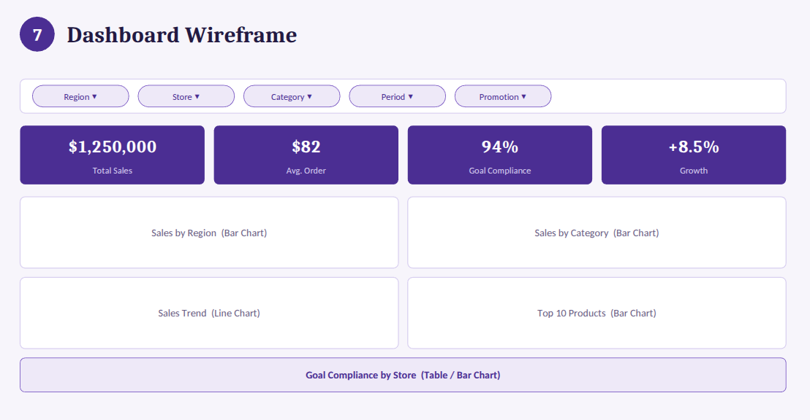
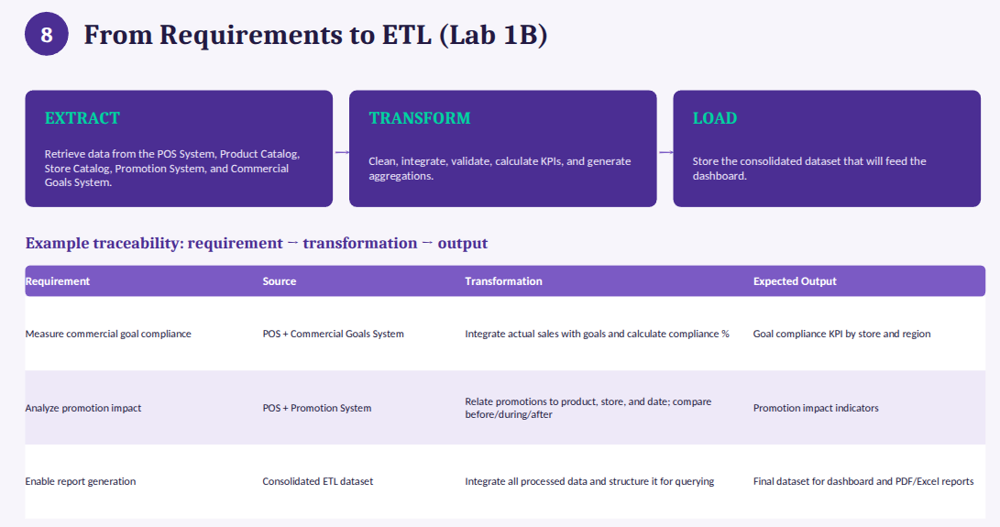
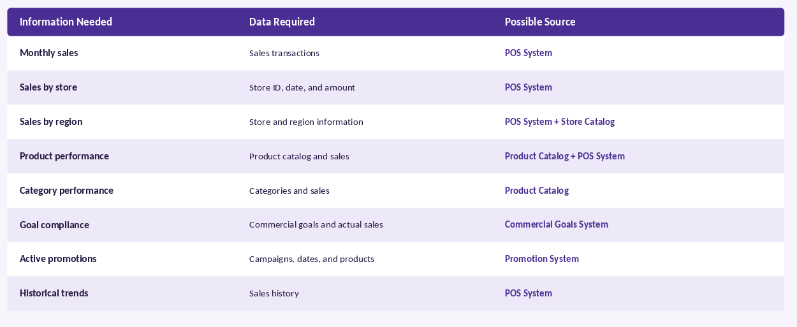

# Retail Analytics Platform - Lab 1A

**Business Requirements Analysis** for a retail data analytics platform using ETL processes.

**Course:** ETL Processes & Data Engineering  
**Term:** 2026-2  
**Group:** G1

---

## Compiled Report

The full report is available at the project root:

**[informe.pdf](informe.pdf)**

---

## Problem

Sales, inventory, and product data are scattered across spreadsheets and different systems (POS, Promotion System, Commercial Goals System), making it difficult for managers to get a quick, reliable view of store performance and make timely, data-driven decisions.

## Objective

Build a centralized analytical platform that enables data-driven decision-making by integrating sales, promotions, and commercial goals data through a robust ETL pipeline.

---

## Activities

| # | Activity | Status |
|---|----------|--------|
| 1 | Business Problem Analysis | Done |
| 2 | Business Objectives | Done |
| 3 | Analytical Questions | Done |
| 4 | Requirements Identification | Done |
| 5 | User Stories | Done |
| 6 | KPIs | Done |
| 7 | Dashboard Wireframe | Done |

---

## Dashboard Wireframe

The proposed low-fidelity wireframe defines the layout of the analytics dashboard, including filters, KPIs, charts, goal compliance, and export functionality.



*Figure 1. Dashboard wireframe — Filters at the top, KPI summary cards, regional and category charts, sales trend line, top 10 products, goal compliance table, and PDF/Excel export section.*

---

## Requirements Overview

Functional, non-functional, and data requirements were identified to guide the platform development.



*Figure 2. Functional and non-functional requirements summary.*

---

## Data Requirements

The following table maps each information need to its data source, required transformation, and expected output for the ETL process.



*Figure 3. Data requirements — mapping information needs to data sources and transformations.*

---

## KPIs

| KPI | Description |
|-----|-------------|
| Total Revenue | Total value of sales across all channels |
| Sales by Store | Performance comparison across branches |
| Sales by Region | Geographic analysis of commercial activity |
| Sales by Category | Revenue contribution by product category |
| Top 10 Best-Selling Products | Most in-demand products for inventory decisions |
| Sales Growth (%) | Period-over-period comparison |
| Goal Compliance Percentage | Degree of commercial objective achievement |
| Sales Increase by Promotion | Impact of promotional campaigns on sales |
| Average Order Value | Average transaction value for operational tracking |

---

## Data Sources

- **POS System** — Sales transactions
- **Product Catalog** — Product and category information
- **Store Catalog** — Store and region data
- **Commercial Goals System** — Assigned commercial objectives
- **Promotion System** — Promotional campaigns and dates

---

## Team

| Member | Role | Responsibilities |
|--------|------|------------------|
| [Deyton Riascos Ortiz](https://github.com/drzriascos) | **Project Manager** | Coordinate the project, organize tasks, consolidate the final report, and prepare the presentation |
| [Samuel Izquierdo Bonilla](https://github.com/samuelizquierdob) | **Development Team** | Lead the definition of requirements, user stories, KPIs, and data mapping |
| [Daniel David Garcia Restrepo](https://github.com/danielgarcia260) | **Product Owner** | Prioritize requirements, validate that responses meet client needs, and review business objectives |
| [Mauricio Taborda Gongora](https://github.com/mauriciotaborda) | **Quality & Analytics** | Data quality validation, SQL queries, testing, and compliance evidence |

---

## Structure

```
.
├── informe.pdf           # Compiled report
├── referencias.bib       # Bibliography (BibTeX)
├── figures/              # Figures (wireframe, requirements)
│   ├── dashboardWireFame.png
│   └── requeriments.png
├── tables/               # Table images
│   └── dataRequirements.png
└── Doc/                  # Source files
    ├── main.tex          # Main LaTeX document
    ├── ETL-G1_2026-2_U1_Lab-1A.pdf
    └── Pitch_ETL_Lab1A.pptx.pdf
```

---

## Build

```bash
cd Doc
pdflatex main.tex
bibtex main
pdflatex main.tex
pdflatex main.tex
cp main.pdf ../informe.pdf
```

---

## References

- DAMA International. *DAMA-DMBOK: Data Management Body of Knowledge*. 2nd Edition, Technics Publications, 2017. [https://www.dama.org/cpages/body-of-knowledge](https://www.dama.org/cpages/body-of-knowledge)
- Project Management Institute. *A Guide to the Project Management Body of Knowledge (PMBOK Guide)*. 7th Edition, PMI, 2021. [https://www.pmi.org/pmbok-guide-standards](https://www.pmi.org/pmbok-guide-standards)
- Microsoft. *Power BI Documentation*. Microsoft Learn. [https://learn.microsoft.com/en-us/power-bi/](https://learn.microsoft.com/en-us/power-bi/)
- Kimball, R. & Ross, M. *The Data Warehouse Toolkit: The Definitive Guide to Dimensional Modeling*. 3rd Edition, Wiley, 2013.
- Inmon, W.H. *Building the Data Warehouse*. 4th Edition, Wiley, 2005.

---

## Authors

- **Deyton Riascos Ortiz** — [GitHub](https://github.com/driosoft-pro)
- **Samuel Izquierdo Bonilla** — [GitHub](https://github.com/ZantaCruz)
- **Daniel David Garcia Restrepo** — [GitHub](https://github.com/danielrestrepo13)
- **Mauricio Taborda Gongora** — [GitHub](https://github.com/Taborda004)
