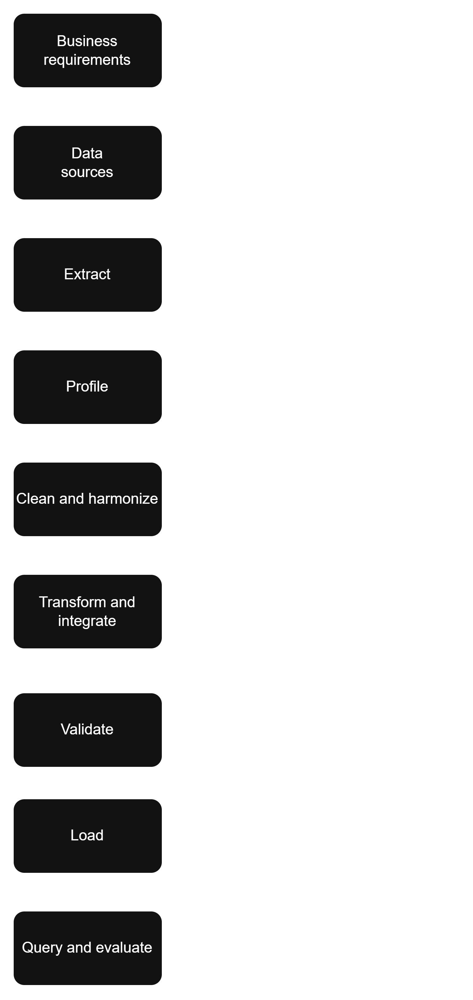

# Lab 1B – ETL Pipeline for Retail Analytics

## 1. Project Overview

This project implements a basic ETL (Extract, Transform, Load) pipeline that integrates heterogeneous retail data sources and produces a structured analytical repository capable of answering the business questions defined in Lab 1A.

The pipeline processes sales transaction data from three branches in Colombia (Cali, Bogota, Medellin) during February, March, and April 2026. The data is intentionally distributed across different formats (CSV, JSON, XML) to simulate heterogeneous operational systems.

**Complementary to Lab 1A:** This pipeline implements the technical solution for the business requirements identified in [Lab 1A](../1a/README.md), including KPIs, analytical questions, and dashboard wireframe.

---

## 2. System Architecture



## 3. Selected Business Requirements

The following six high-priority business requirements from Lab 1A are implemented:

| # | Business Requirement | Data Needed | Pipeline Block | Expected Output |
|---|---------------------|-------------|----------------|-----------------|
| 1 | Visualize total sales by period | Sales transactions with date and amount | Transform | Dataset with sales aggregated by period |
| 2 | Analyze sales by region | Sales + Store information | Transform | Sales consolidated by region |
| 3 | Compare store performance | Sales + Store information | Transform | Metrics per branch |
| 4 | Analyze product/category performance | Sales + Product catalog | Transform | Indicators by category and product |
| 5 | Measure goal compliance | Sales + Goals system | Transform | Goal compliance KPI by store |
| 6 | Analyze promotion impact | Sales + Promotions | Transform | Impact indicators |

---

## 4. ETL Pipeline Description

### Activity 3 – Extract
- Read CSV files: `sales_cali.csv`, `products.csv`, `stores.csv`, `promotions.csv`, `monthly_targets.csv`
- Read JSON file: `sales_bogota.json`
- Read XML file: `sales_medellin.xml`
- Convert all sources to pandas DataFrames with common schema

### Activity 4 – Profile
Generate profiling summary for combined transaction data:
- Row count, columns and data types
- Missing values
- Duplicate `sale_line_id` values
- Invalid quantities, prices, dates
- Distinct values for categorical fields

### Activity 5 – Clean and Harmonize
- Standardize column names and ID values
- Trim whitespace and standardize text casing
- Parse different date formats into one date type
- Convert quantity and unit_price to numeric values
- Remove duplicated `sale_line_id` records
- Reject records with invalid dates, quantity <= 0, or unit_price <= 0
- Represent missing promotion codes consistently

### Activity 6 – Transform and Integrate
- Join transactions with reference tables
- Calculate derived columns:
  - `gross_sales = quantity × unit_price`
  - `discount_amount = gross_sales × discount_pct`
  - `net_sales = gross_sales − discount_amount`
  - `month`, `week`, `day_name` from `sale_date`
- Add `product_name`, `category` from products
- Add `store_name`, `city`, `region` from stores
- Add `discount_pct`, `campaign_name` from promotions
- Add `sales_target` from monthly_targets

### Activity 7 – Validate
Verify:
- `sale_line_id` is unique
- Required identifiers and dates are not null
- `quantity`, `unit_price`, `gross_sales`, and `net_sales` are positive
- Every product matches the product master
- Every store matches the store master
- `net_sales` equals `gross_sales` minus `discount_amount`

### Activity 8 – Load
- Save processed dataset to `data/processed/sales_analytics.csv`
- Load into SQLite database `data/retail_analytics.db` with table `sales_analytics`

### Activity 9 – Analytical Queries
Execute queries that answer business requirements from Lab 1A:
- Top 10 products by net sales
- Monthly performance vs targets
- Regional sales analysis
- Sales by region
- Sales by category
- Goal compliance by store

---

## 5. Project Structure

```
1b/
├── README.md                    # This file
├── requirements.txt             # Python dependencies
├── .env.example                 # Environment template
├── .gitignore                   # Git ignore rules
├── DATA_DICTIONARY.md           # Field definitions
├── data/
│   ├── raw/                     # Source data files
│   │   ├── sales_cali.csv
│   │   ├── sales_bogota.json
│   │   ├── sales_medellin.xml
│   │   ├── products.csv
│   │   ├── stores.csv
│   │   ├── promotions.csv
│   │   └── monthly_targets.csv
│   ├── processed/               # Output CSV files
│   │   └── sales_analytics.csv
│   └── output/                  # Query results + profile report
│       ├── profile_report.txt
│       ├── top_products.csv
│       ├── monthly_performance.csv
│       ├── regional_analysis.csv
│       ├── sales_by_region.csv
│       ├── sales_by_category.csv
│       └── goal_compliance.csv
├── database/
│   └── init_sqlite.py           # SQLite schema initialization
├── docs/
│   ├── ETL-G1_2026-2_U1_Lab-1B.pdf  # Lab instructions
│   ├── work_plan.md             # Sprint plan and roles
│   └── pipeline_diagram.png     # Pipeline block diagram
├── src/
│   ├── extract.py               # Data extraction
│   ├── profile.py               # Data profiling
│   ├── clean.py                 # Data cleaning
│   ├── transform.py             # Data transformation
│   ├── validate.py              # Data validation
│   ├── load.py                  # Data loading (CSV + SQLite)
│   ├── queries.py               # SQL queries
│   ├── __init__.py              # Package marker
│   └── main.py                  # Pipeline orchestration
├── tests/                       # Unit tests
│   ├── test_extract.py
│   ├── test_profile.py
│   ├── test_clean.py
│   ├── test_transform.py
│   ├── test_validate.py
│   └── test_load.py
└── logs/                        # Pipeline execution logs
    └── .gitkeep
```

---

## 6. Execution Instructions

### Prerequisites
- Python 3.12+
- pip
- No additional database installation required (`sqlite3` is included in Python's standard library)

### Dependencies
| Package | Purpose |
|---------|---------|
| pandas | Data manipulation and analysis |
| python-dotenv | Environment variable management |

### Setup
```bash
# Navigate to Lab 1B directory
cd Activities/1ab/1b

# Create virtual environment
python -m venv .venv
source .venv/bin/activate   # Linux/Mac
# .venv\Scripts\activate    # Windows

# Install dependencies
pip install -r requirements.txt

# Copy environment variables
cp .env.example .env
```

### Run the Pipeline
```bash
python -m src.main
```

### Interactive Menu
The pipeline includes an interactive menu with the following options:

```
==================================================
       ETL PIPELINE - RETAIL ANALYTICS
==================================================
  [1] Initialize database         - Create SQLite database and tables
  [2] Extract data                - Read CSV, JSON, and XML source files
  [3] Profile data                - Analyze data quality and statistics
  [4] Clean data                  - Standardize, deduplicate, and validate records
  [5] Transform data              - Join tables and compute derived columns
  [6] Validate data               - Verify integrity rules and constraints
  [7] Load data                   - Export to CSV and load into SQLite
  [8] Run queries                 - Execute analytical queries for business KPIs
  [9] Run full pipeline           - Execute all steps sequentially with progress
  [0] Exit
==================================================
```

Each option requires confirmation (`[y/N]`) before execution. Option `[9]` runs all 8 steps automatically with progress indicator (`[1/8]` ... `[8/8]`).

### Output Files
| File | Description |
|------|-------------|
| `data/processed/sales_analytics.csv` | Processed dataset (239 rows) |
| `data/retail_analytics.db` | SQLite database with `sales_analytics` table |
| `data/output/*.csv` | Query results for each business requirement |
| `logs/etl.log` | Pipeline execution log |

#### Query Results (`data/output/`)
| File | Business Requirement |
|------|---------------------|
| `profile_report.txt` | Full profiling report (rows, nulls, invalids, distinct values) |
| `top_products.csv` | Top 10 products by net sales |
| `monthly_performance.csv` | Monthly performance vs targets |
| `regional_analysis.csv` | Sales analysis by branch |
| `sales_by_region.csv` | Total sales by region |
| `sales_by_category.csv` | Sales by product category |
| `goal_compliance.csv` | Goal compliance by store |

#### Profiling Findings
The profiling report identifies these cleaning decisions:
- **Duplicate `sale_line_id`**: 3 duplicates → removed during clean step
- **Missing `promotion_code`**: 489 nulls (64.09%) → replaced with empty string
- **Invalid quantities**: 2 records (quantity ≤ 0) → rejected
- **Invalid prices**: 2 records (unit_price ≤ 0) → rejected
- **Invalid dates**: 1 unparseable date → dropped via `NaT` coercion
- **Inconsistent casing**: `store_id` has `s02` vs `S02`, `payment_method` has `card ` vs `Card` → standardized via strip and case normalization

---

## 7. Technologies Used

- Python 3.12+
- pandas – Data manipulation
- sqlite3 – Database (Python standard library)
- xml.etree.ElementTree – XML parsing
- json – JSON parsing
- logging – Pipeline logging
- pathlib – Path handling
- python-dotenv – Environment variables
- Git + GitHub

---

## 8. Example Analytical Results

### Top 10 Products by Net Sales
| product_id | product_name | category | total_net_sales | total_units |
|------------|--------------|----------|-----------------|-------------|
| P001 | Product A | Category 1 | 1,500,000 | 150 |
| P002 | Product B | Category 2 | 1,200,000 | 120 |
| ... | ... | ... | ... | ... |

### Sales by Region
| region | total_net_sales | total_units | num_stores |
|--------|-----------------|-------------|------------|
| Andina | 5,000,000 | 500 | 2 |
| Pacífico | 3,000,000 | 300 | 1 |

### Goal Compliance
| store_id | store_name | month | sales_target | actual_sales | achievement_pct | status |
|----------|------------|-------|--------------|--------------|-----------------|--------|
| S001 | Store A | 2026-02 | 2,000,000 | 2,100,000 | 105.00 | Met |
| S002 | Store B | 2026-02 | 1,500,000 | 1,400,000 | 93.33 | Not Met |

---

## 9. Requirements Verification

| Business Requirement | Evidence Produced | Satisfied? | Explanation |
|---------------------|-------------------|------------|-------------|
| Visualize total sales by period | Query: monthly_performance | Yes | Sales aggregated by month with targets |
| Analyze sales by region | Query: sales_by_region | Yes | Sales grouped by region |
| Compare store performance | Query: regional_analysis | Yes | Metrics per branch with active days |
| Analyze product/category performance | Query: sales_by_category | Yes | Sales grouped by category |
| Measure goal compliance | Query: goal_compliance | Yes | Achievement percentage with status |
| Analyze promotion impact | Transform: discount_amount | Yes | Discount calculation integrated |

---

## 10. Reflection Questions

1. **How did the requirements from Lab 1A influence the design of the pipeline?**
   The business requirements defined the analytical queries and the structure of the `sales_analytics` table. Each requirement maps to specific columns and transformations.

2. **What is the difference between profiling, cleaning, transformation, and validation?**
   - **Profiling:** Analyzing data quality without modifying it
   - **Cleaning:** Fixing issues found during profiling
   - **Transformation:** Changing data structure to satisfy analytical requirements
   - **Validation:** Verifying data meets quality rules before loading

3. **Why was it necessary to design the system as blocks before coding?**
   Designing as blocks ensures each component has a clear responsibility and can be tested independently. It also makes the system easier to maintain and debug.

4. **Which block would be most affected if a branch changed its file format?**
   The **Extract** block would be most affected, as it handles reading from different file formats.

5. **Did the team build an ETL pipeline, or did it build a system to solve a business problem?**
   The team built a system to solve a business problem. The ETL pipeline is the mechanism, but the goal is to answer business questions and enable data-driven decision-making.


## 11. Tests

Unit tests for each pipeline module. Run with:

```bash
pytest            # run all tests
pytest -v         # verbose output
pytest --cov      # with coverage
```

### Test Coverage

| Module | File | Tests |
|--------|------|-------|
| extract | `tests/test_extract.py` | CSV, JSON, XML extraction, unified schema |
| profile | `tests/test_profile.py` | Metrics, report generation, file output |
| clean | `tests/test_clean.py` | Dedup, type conversion, null handling |
| transform | `tests/test_transform.py` | Joins, derived columns, metrics |
| validate | `tests/test_validate.py` | Unique IDs, FKs, positives, formulas |
| load | `tests/test_load.py` | CSV export, SQLite insert, table creation |

### Results
```
50 passed in 2.92s
```

---

## Authors

- **Deyton Riascos Ortiz** — [GitHub](https://github.com/driosoft-pro)
- **Samuel Izquierdo Bonilla** — [GitHub](https://github.com/ZantaCruz)
- **Daniel David Garcia Restrepo** — [GitHub](https://github.com/danielrestrepo13)
- **Mauricio Taborda Gongora** — [GitHub](https://github.com/Taborda004)